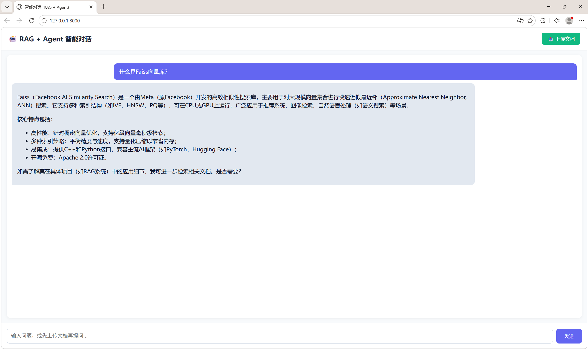
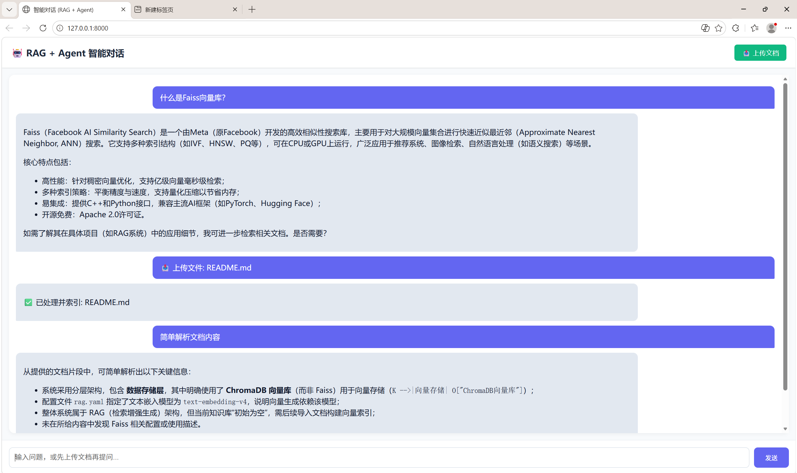

# 🚀 智能对话服务 (v1.0.0)

## 项目简介

基于 FastAPI + LangChain 构建的轻量级智能对话系统，集成 RAG 技术，支持文档问答与多轮对话。后端接入通义千问 Qwen-plus 大模型。


## 核心特性

- 文档上传并自动向量化，支持基于文档内容的精准问答
- Agent 自主调用工具（文档检索、时间查询）
- 多轮对话上下文记忆
- 提供 RESTful API 与简单前端界面


## 快速开始

### 环境要求

- Python 3.10+
- 阿里云 DashScope API Key

### 安装依赖

```bash
pip install fastapi uvicorn python-dotenv langchain langchain-openai langchain-community langgraph dashscope faiss-cpu langchain-text-splitters
```

## 配置API

- 项目根目录创建 .env 文件：
```
DASHSCOPE_API_KEY=你的API密钥
```


## 启动服务

```bash
cd backend
python main.py
```
- 访问 http://127.0.0.1:8000 使用前端界面，或查看 http://127.0.0.1:8000/docs 获取 API 文档。


## 技术栈

- Web 框架：FastAPI

- 大模型：通义千问 Qwen-plus

- Agent 框架：LangChain + LangGraph

- 向量数据库：FAISS

- 嵌入模型：text-embedding-v3


## 示例


**能正常对话**


**能正常读文档**

